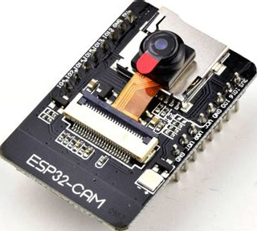
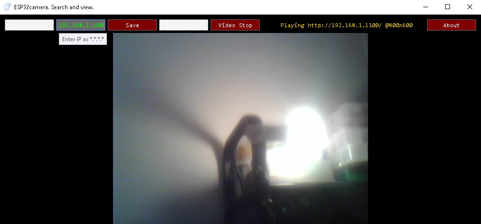

# ESP32camera viewer/tester/LAN finder.  
Windows .NET software for searching and playing arduino ESP32 camera video stream.  
Using AForge.NET www.aforgenet.com/framework/  
  
  
  
Works by switching between two modes (for compatibility):  
1. Included arduino ino file example for "CAMERA_MODEL_AI_THINKER" only. Video url is "http://IP/"  
2. Espressif [CameraWebServer.ino](https://github.com/espressif/arduino-esp32/tree/master/libraries/ESP32/examples/Camera/CameraWebServer). Video url is "http://IP:81/stream"  
  
You'd better edit this before compiling. Add your own easely!  
Cycling by starting then stopping video stream.  
  
  
  
  
  
Standard arduino ESP32 library registers as "esp32-XXXXXX" in your router so searching for ESP32camera progressing this way:  
1. Trying to get local IP address. If you have many active network adapters or any tricky network setup it will fail.  
2. Creating the list of pingable IPs in your LAN "x.x.x.*".  
3. Resolving hosts for those IPs.  
4. Comparing hosts thats starts with "esp32". Only first one is to use!  
  
While any search goes wrong you are welcome to enter IP manually then save.  
  
Fixing window to match native stream size @~196-197 lines.  
  
  
Example software!  
  
Thank you.    
  
